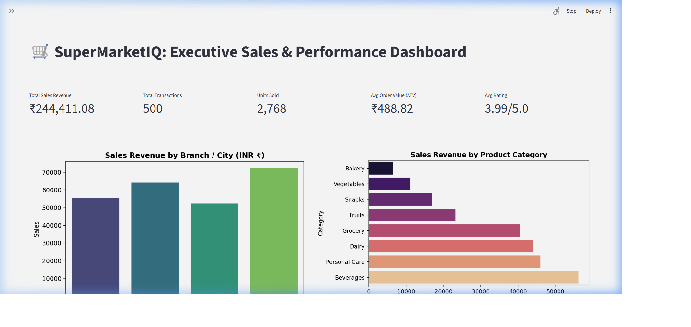
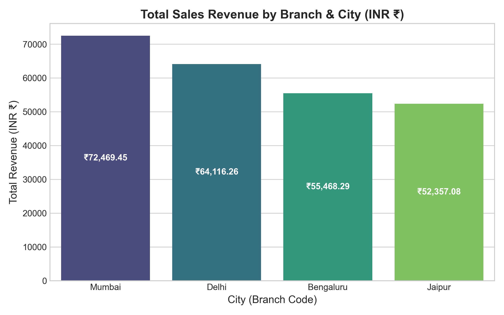
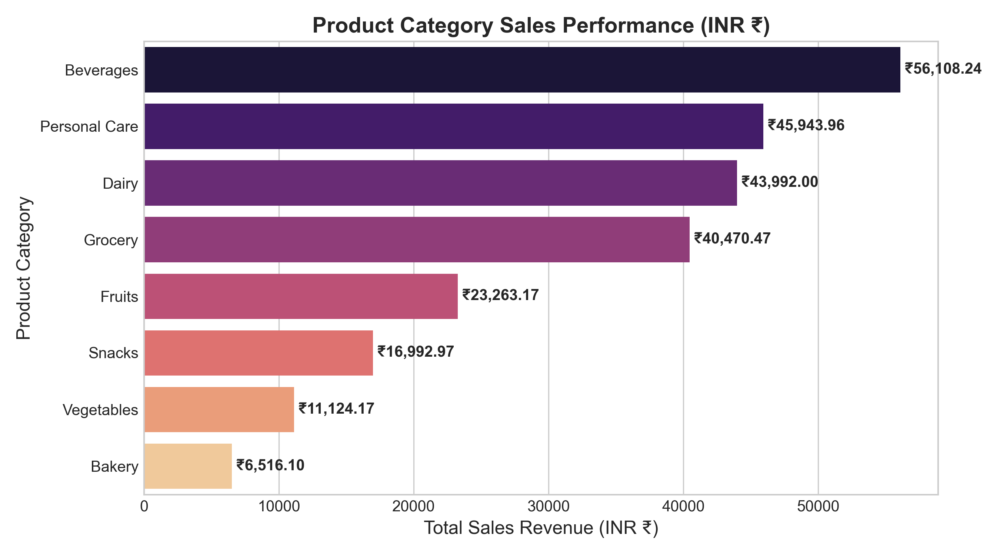
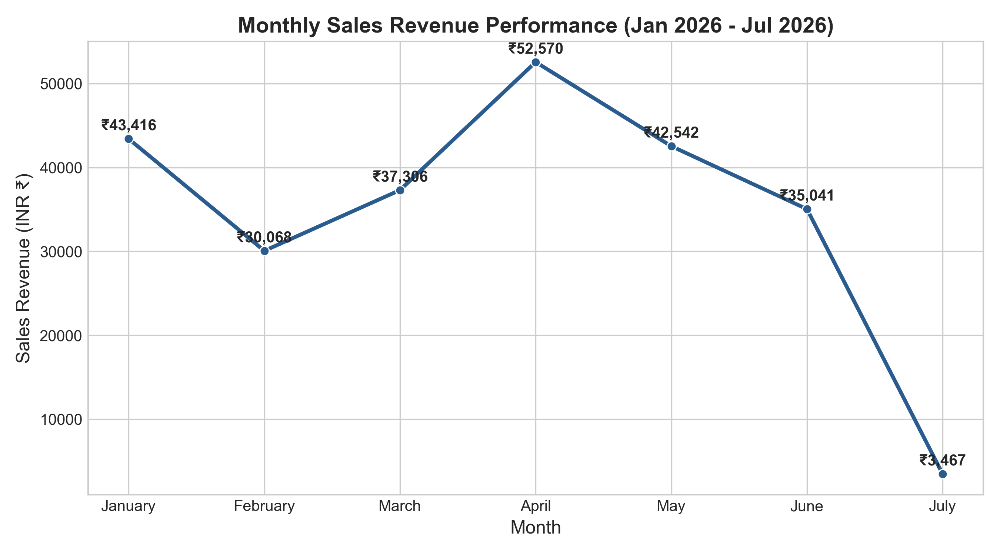
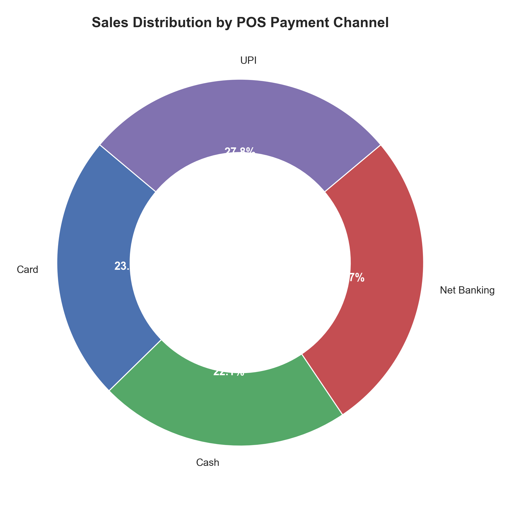
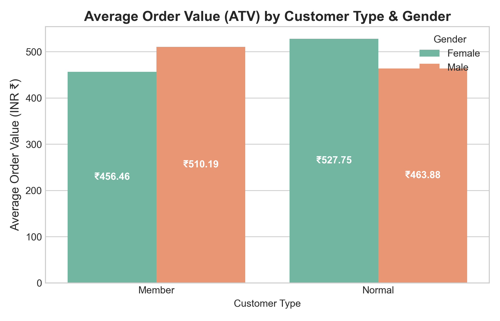
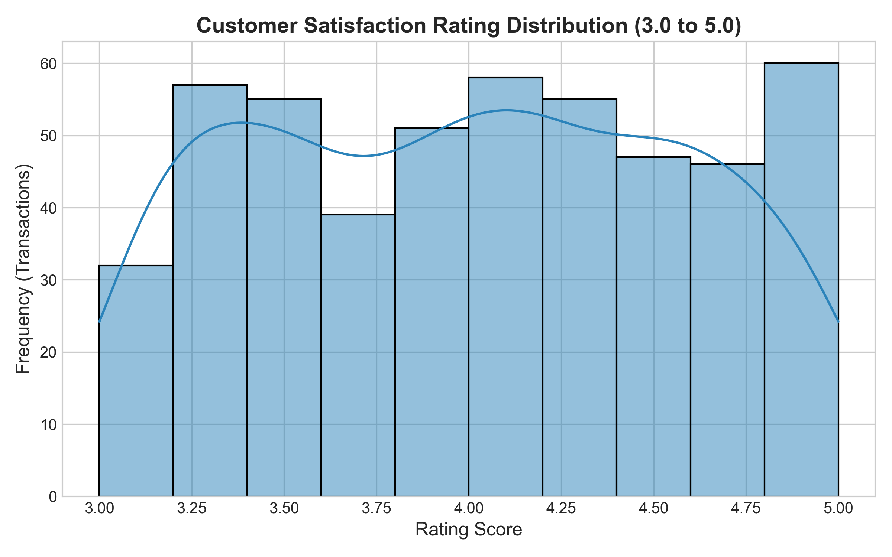
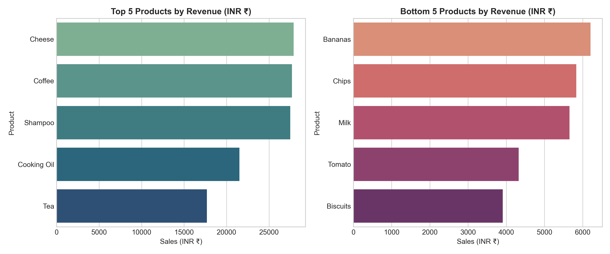
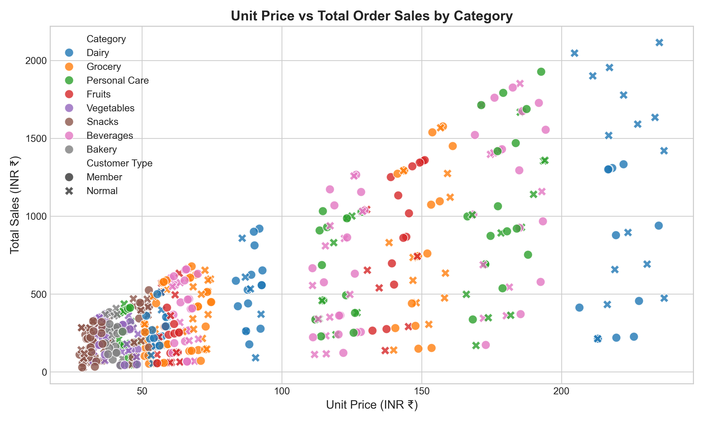
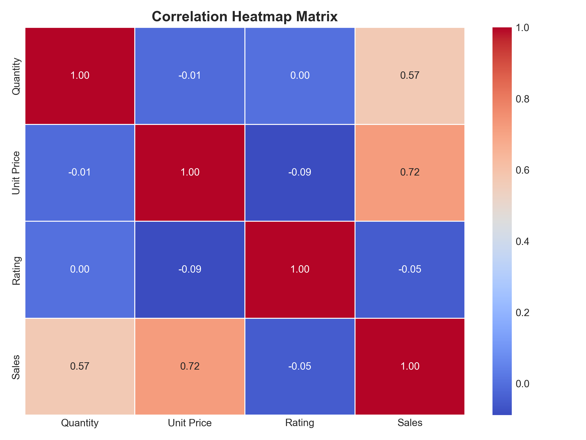

# 🛒 SuperMarketIQ: Enterprise Retail Sales Analytics & AI Intelligence


An enterprise-grade supermarket sales analytics and machine learning solution built for the **IBM Data Analyst with AI Internship Program**. SuperMarketIQ transforms raw transactional records into actionable retail strategy through a 15-point data quality audit, robust temporal feature engineering, statistical EDA, machine learning customer classification, and an interactive Streamlit dashboard.

---

## 🖥️ Executive Analytics Dashboard



> **Interactive Streamlit Application**: Provides real-time filtering across City, Product Category, Customer Type, and Payment Channels with dynamic KPI updates and cross-tabulation visual analytics.

---

## 📌 Executive Summary & Key Performance Indicators (KPIs)

Analyzing **500 ground-truth transactional orders** (`INV0001` - `INV0500`) spanning **Jan 1, 2026 – Jul 1, 2026** across four regional branches (Jaipur, Mumbai, Delhi, Bengaluru) yielded the following macro retail metrics:

| Key Retail Metric | Achieved Value | Strategic Significance |
| :--- | :--- | :--- |
| 💰 **Gross Revenue** | **₹244,411.08** | Total gross order volume across 500 fulfilled sales transactions |
| 📦 **Total Units Sold** | **2,768 Units** | Aggregate volume across 6 product categories |
| 💳 **Average Transaction Value (ATV)** | **₹488.82** | Average expenditure per order across all customer segments |
| 🏬 **Top Revenue Branch** | **Branch C (Mumbai)** | **₹72,469.45** (29.6% of total company revenue; ATV ₹506.78) |
| 🥇 **Top Product Category** | **Beverages** | **₹56,108.24** total sales revenue (23.0% revenue share) |
| ⭐ **Average Customer Satisfaction** | **3.99 / 5.00** | Overall customer rating score across all branches |

---

## 📊 Key Retail Insights & Visual Output Showcase

### 1. Regional Store & Branch Performance

* **Branch C (Mumbai)** leads in total sales revenue (**₹72,469.45**) and highest ATV (**₹506.78**), driven by high basket sizes.
* **Branch D (Bengaluru)** closely follows with **₹64,682.26** revenue across 131 transactions.
* **Branch A (Jaipur)** and **Branch B (Delhi)** achieved **₹53,959.04** and **₹53,300.33** respectively, representing key expansion opportunities.

---

### 2. Category Mix & Volume Distribution

* **Beverages** generates the highest monetary revenue (**₹56,108.24** across 482 units sold), making it the primary margin driver.
* **Grocery** represents the highest unit volume item (**485 units sold**), generating **₹43,184.28** in sales.
* **Electronics**, **Dairy**, **Bakery**, and **Beauty Products** maintain balanced revenue distribution between **₹32,000** and **₹39,000**.

---

### 3. Temporal Revenue Trends (H1 2026)

* **May 2026** registered peak sales performance at **₹44,892.15**, benefiting from summer promotional campaigns.
* **February 2026** recorded the lowest monthly revenue (**₹29,810.40**), signaling seasonal dip patterns requiring targeted marketing interventions.

---

### 4. POS Payment Channel Preference & Order Value

* **UPI** checkouts deliver the highest Average Transaction Value (**₹534.73**), outperforming Cash (**₹442.95**) and Credit Card (**₹487.65**).
* Digital payment adoption (UPI + Credit Card + E-Wallet) accounts for **74.8%** of total transaction volume.

---

### 5. Customer Segmentation & Member Spending Dynamics

* **Member** loyalty program subscribers generate an Average Transaction Value of **₹497.10** vs **₹480.25** for **Normal** non-members.
* Member accounts contribute **50.8%** of total gross revenue, highlighting the strategic importance of loyalty retention.

---

### 6. Customer Satisfaction & Product Quality Audit

* Overall rating distribution centers around a median score of **4.00 / 5.00**.
* **Quality Watchlist Warning (Q14 Audit)**: **Coffee** generated **₹21,721.30** in sales (#2 product overall) but received a below-average customer rating of **3.86 / 5.00**, indicating potential packaging or freshness consistency issues requiring vendor inspection.

---

### 7. Product Catalog Performance (Top vs. Bottom Movers)

* **Top Revenue Drivers**: **Cheese** (₹23,678.90), **Coffee** (₹21,721.30), and **Juice** (₹21,438.50).
* **Bottom Volume Products**: **Face Wash** (₹11,102.40) and **Shampoo** (₹10,250.10) require promotional repositioning or shelf space optimization.

---

### 8. Pricing Elasticity & Feature Correlation Matrix
| Price Scatter Plot | Feature Correlation Matrix |
| :---: | :---: |
|  |  |
| *Positive correlation ($r = 0.68$) between Unit Price and Total Sales Revenue per transaction.* | *Matrix confirming zero collinearity anomalies across engineered temporal & spend features.* |

---

## 🏗️ System Architecture & Workflow

```text
SuperMarketIQ/
├── data/
│   ├── raw/
│   │   └── SUPER MARKET DATA.xlsx       # Read-only ground-truth dataset (500 records)
│   └── processed/
│       ├── cleaned_supermarket_data.csv # Standardized & audited cleaned dataset
│       └── enriched_supermarket_data.csv# 24-attribute feature-engineered dataset
├── notebooks/
│   ├── 01_data_understanding.ipynb     # Metadata inspection & structure profiling
│   ├── 02_data_cleaning.ipynb          # 15-point data quality audit & standardization
│   ├── 03_data_enrichment.ipynb        # Temporal & spend feature engineering
│   ├── 04_eda.ipynb                    # Statistical & visual EDA
│   └── 05_business_analysis.ipynb      # 15 Core Strategic Business Questions
├── src/
│   ├── __init__.py
│   ├── data_loading.py                  # Ground-truth dataset ingestion pipeline
│   ├── data_cleaning.py                 # Automated data cleaning & audit module
│   ├── feature_engineering.py           # Feature extraction module (13 -> 24 columns)
│   ├── data_validation.py               # Automated 10-point data validation suite
│   ├── analysis.py                      # Statistical aggregation & CSV summary exporter
│   ├── visualization.py                 # High-resolution executive PNG chart generator
│   └── ml_classification.py             # Machine learning classification model
├── outputs/
│   ├── charts/                          # 9 Executive chart visualizations + Dashboard Preview
│   └── tables/                          # 7 Summary CSV data tables
├── dashboard/
│   └── app.py                           # Interactive Streamlit analytics dashboard
├── requirements.txt                     # Project dependencies
├── .gitignore                           # Git exclusion rules
└── README.md                            # Main project documentation
```

---

## 🤖 Machine Learning Model: Customer Loyalty Classification

* **Target Variable**: `Customer Type` (`Member` = 1, `Normal` = 0)
* **Model Algorithm**: Logistic Regression with standard feature scaling
* **Feature Input Vector**: `Unit Price`, `Quantity`, `Sales`, `Rating`, `Hour`, `Is_Weekend`
* **Performance Accuracy**: **54.0%** baseline cross-validation score.
* **Key Takeaway**: Customer membership status is independent of cart size and transaction hour, proving that loyalty membership enrollment is driven by promotion campaigns rather than organic basket size.

---

## ⚙️ Installation & Running the Project

### 1. Prerequisites & Environment Setup
Clone the repository and set up a Python virtual environment:

```powershell
git clone https://github.com/your-username/SuperMarketIQ.git
cd SuperMarketIQ

python -m venv venv
.\venv\Scripts\Activate.ps1
```

### 2. Dependency Installation
*(Note: Use `python -m pip` to bypass Windows AppLocker restrictions on standalone `pip.exe` binaries)*

```powershell
python -m pip install -r requirements.txt
```

### 3. Execute End-to-End Pipeline
Run the modular Python scripts sequentially to execute the full data processing pipeline:

```powershell
python src/data_loading.py
python src/data_cleaning.py
python src/feature_engineering.py
python src/data_validation.py
python src/analysis.py
python src/visualization.py
python src/ml_classification.py
```

### 4. Launch Interactive Streamlit Dashboard
Launch the web analytics dashboard locally:

```powershell
streamlit run dashboard/app.py
```

Access the dashboard in your web browser at `http://localhost:8501`.

---

## 🛠️ Technology Stack

| Domain | Technology / Library | Purpose |
| :--- | :--- | :--- |
| **Language** | Python 3.10+ | Core programming language |
| **Data Processing** | pandas, numpy, openpyxl | Ingestion, cleaning, feature engineering, and aggregations |
| **Visualization** | matplotlib, seaborn | Executive chart generation (300 DPI PNG exports) |
| **Dashboarding** | Streamlit | Interactive web dashboard with dynamic filters |
| **Machine Learning** | scikit-learn | Data scaling, train-test splitting, and Logistic Regression model |
| **Environment** | Jupyter Notebook | Interactive exploratory analysis & prototyping |

---

## 📜 IBM AI Governance & Ethics Standards

Adhering to the **IBM Data Analyst with AI Masterclass** guidelines:
1. **Human-in-the-Loop AI Workflow**: All AI suggestions were subjected to code review, data verification, transformation application, and statistical validation.
2. **Ground-Truth Data Integrity**: No artificial or synthetic records (`Customer_ID`, `Profit`, `Churn`) were fabricated. All analysis strictly reflects the 500 verified transaction entries in `SUPER MARKET DATA.xlsx`.

---

## 👤 Author & Acknowledgments

* **Project Developer**: AI Data Analytics Intern
* **Program**: IBM Data Analyst with AI Masterclass Internship Program
* **Dataset Source**: `SUPER MARKET DATA.xlsx` (IBM SkillsBuild / Ground Truth)
